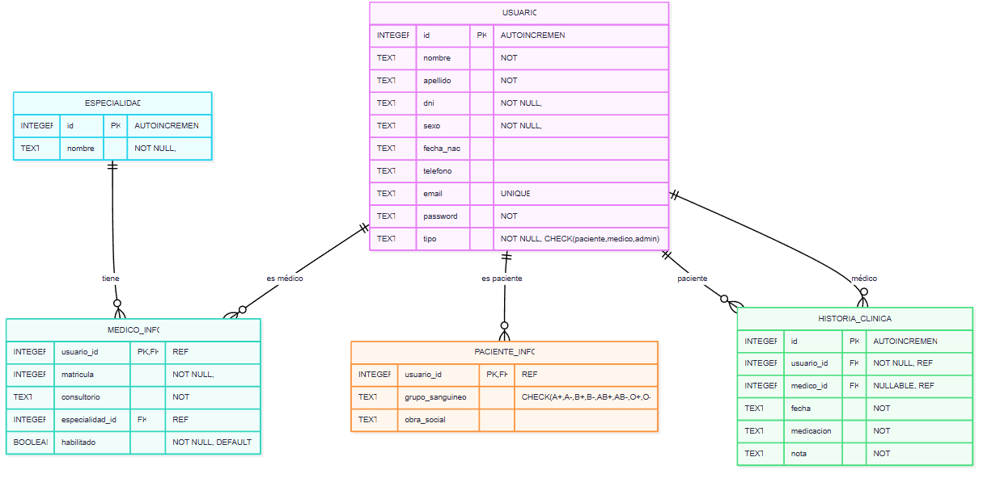

# Backend - Api y base de datos
# CONSULTORIOS MÉDICOS UTN
# UTN - TUP | PPS 2025
# Alumno Juan Jose Chaparro

## Descripción
El repositorio contiene la parte del backend de un proyecto para las **PPS** de la Tecnicatura Universitaria en Programación (UTN FRBB). Esta API, construida con **Node.js** y **Express.js**, proporciona funcionalidades para un Consultorio Médico: la gestión de usuarios, autenticación mediante JWT (JSON Web Tokens), y conexión a una base de datos SQLite.

## Características
- **Autenticación de usuarios**: Registro e inicio de sesión con JWT y encriptación de contraseñas usando `bcryptjs`.
- **Gestión de usuarios**: Creación, lectura, actualización y eliminación de usuarios.
- **Conexión a base de datos**: Integración con `sqlite3` para almacenar datos de usuarios y otras entidades.
- **Endpoints RESTful**: API diseñada para operaciones CRUD.

## Instalación
Sigue estos pasos para configurar el proyecto localmente:

1. **Clona el repositorio**:
   ```bash
   git clone https://github.com/ChapaStone1/TUP_PPS_API.git
   cd TUP_PPS_API
   ```

2. **Instala las dependencias**:
   ```bash
   npm install express sqlite3 bcrypt cors dotenv jsonwebtoken
   ```

3. **Configura las variables de entorno**:
   Crea un archivo `.env` en la raíz del proyecto con las siguientes variables:
   ```env
   SECRET_KEY=Clave123
   JWT_SECRET=miclavesecreta123
   PORT=3000
   ```

4. **Inicia el servidor**:
   ```bash
   npm run start
   ```

La API estará disponible en `http://localhost:3000`.

## Base de datos

Diagrama entidad-relación:  



# Endpoints

Los endpoints fueron diseñados en función de las acciones específicas que puede realizar cada tipo de usuario. Por ejemplo, el usuario administrador tiene permisos para resetear contraseñas de cualquier usuario o eliminar pacientes, el usuario médico puede cargar consultas, listar pacientes, modificar su perfil, y el usuario paciente que puede modificar su perfil y ver su historia clinica.


## 🔐 Autenticación

### 📝 Registrar paciente

- **Método:** `POST`  
- **Ruta:** `/api/auth/register-paciente`

#### 📥 Request Body:
```json
{
  "nombre": "Ana",
  "apellido": "Gómez",
  "dni": "12345678",
  "sexo": "femenino",
  "fecha_nac": "1990-05-12",
  "email": "ana@example.com",
  "telefono": "1122334455",
  "password": "claveSegura123",
  "grupo_sanguineo": "O+",
  "obra_social": "OSDE"
}
```

#### 📤 Respuesta:
```json
{
  "message": "Paciente registrado exitosamente",
  "usuarioId": 6
}
```

---

### 🔓 Login

- **Método:** `POST`  
- **Ruta:** `/api/auth/login`

#### 📥 Request Body:
```json
{
  "email": "ana@example.com",
  "password": "claveSegura123"
}
```

#### 📤 Respuesta:
```json
{
  "message": "Login exitoso",
  "token": "eyJhbGciOiJIUzI1NiIsInR5cCI6IkpXVCJ9...",
  "tipo": "paciente"
}
```

---

## 📌 Endpoints para Administradores (Todos requieren Token y ser usuario tipo admin)

### ➕ Crear médico

- **Método:** `POST`  
- **Ruta:** `/api/medicos/cargar-medico`

#### 📥 Request Body:
```json
{
  "nombre": "Laura",
  "apellido": "Sosa",
  "dni": "55667788",
  "sexo": "femenino",
  "fecha_nac": "1985-08-20",
  "telefono": "555667788",
  "email": "laura@example.com",
  "password": "clave123",
  "matricula": "MP67890",
  "consultorio": "202",
  "especialidad_id": 2
}
```

#### 📤 Respuesta:
```json
{
  "message": "Médico creado correctamente",
  "id": 3
}
```

---

### ❌ Eliminar paciente

- **Método:** `DELETE`  
- **Ruta:** `/api/medicos/eliminar-paciente/:idpaciente`

#### 📤 Respuesta:
```json
{
  "message": "Paciente eliminado correctamente"
}
```

---

### 🔁 Habilitar/Deshabilitar médico (para que el médico se muestre disponible en la lista que ven los pacientes)

- **Método:** `PATCH`  
- **Ruta:** `/admin/habilitacion-medico/:id`

#### Parámetro:
- `:id` → ID del médico (`usuario_id`)

#### Respuesta:
```json
{
  "status": 200,
  "message": "Médico habilitado correctamente"
}
```

---

### 📄 Listar todos los médicos

- **Método:** `GET`  
- **Ruta:** `/admin/all-medicos`

#### 📤 Respuesta:
```json
{
  "status": 200,
  "data": [
    {
      "id": 14,
      "nombre": "Juan",
      "apellido": "Pérez",
      "dni": "12345678",
      "sexo": "M",
      "fecha_nac": "1980-01-01",
      "telefono": "1122334455",
      "email": "juan@example.com",
      "matricula": "MAT123",
      "consultorio": "Consultorio 1",
      "habilitado": 1,
      "especialidad_id": 2,
      "especialidad_nombre": "Cardiología"
    }
  ]
}
```

---

### 👥 Listar usuarios

- **Método:** `GET`  
- **Ruta:** `/admin/all-users?dni=1234&limit=10&offset=0`

#### Query params:
- `dni` → (opcional) filtro parcial por DNI
- `limit` → (opcional) cantidad máxima de resultados
- `offset` → (opcional) desde qué índice empezar

#### 📤 Respuesta:
```json
{
  "status": 200,
  "data": [
    {
      "id": 3,
      "nombre": "Ana",
      "apellido": "Gómez",
      "dni": "12345678",
      "sexo": "F",
      "fecha_nac": "1990-05-10",
      "telefono": "1122448899",
      "email": "ana@gmail.com",
      "tipo": "paciente"
    }
  ]
}
```

---

### 🔄 Resetear contraseña

- **Método:** `PATCH`  
- **Ruta:** `/admin/reset-password/:id`

#### 📤 Respuesta:
```json
{
  "status": 200,
  "data": "Contraseña restablecida para el usuario 3, password: "clave12345678""
}
```

---

## 📌 Endpoints para Pacientes

### ✅ Obtener perfil

- **Método:** `GET`  
- **Ruta:** `/api/pacientes/mi-perfil` 

#### 📤 Respuesta:
```json
{
  "id": 1,
  "nombre": "Ana",
  "apellido": "Gómez",
  "dni": "12345678",
  "sexo": "femenino",
  "fecha_nac": "1990-05-12",
  "telefono": "1122334455",
  "email": "ana@example.com",
  "grupo_sanguineo": "O+",
  "obra_social": "OSDE"
}
```

---

### 📝 Actualizar perfil

- **Método:** `PUT`  
- **Ruta:** `/api/pacientes/mi-perfil`

#### 📥 Request Body:
```json
{
  "nombre": "Ana",
  "apellido": "Gómez",
  "dni": "12345678",
  "sexo": "femenino",
  "fecha_nac": "1990-05-12",
  "telefono": "1122334455",
  "email": "ana@example.com",
  "password": "nuevaClave123",
  "grupo_sanguineo": "O+",
  "obra_social": "OSDE"
}
```

#### 📤 Respuesta:
```json
{
  "message": "Perfil actualizado correctamente"
}
```

---

### 📚 Ver historia clínica

- **Método:** `GET`  
- **Ruta:** `/api/pacientes/historia-clinica`

#### 📤 Respuesta:
```json
[
  {
    "id": 10,
    "fecha": "2024-05-22",
    "nota": "Chequeo general sin complicaciones",
    "medicacion": "Paracetamol",
    "medico_nombre": "Carlos",
    "medico_apellido": "Pérez",
    "consultorio": "101",
    "especialidad": "Clínica General"
  }
]
```

---

## ⚙️ Endpoints para Médicos

### ✅ Obtener perfil

- **Método:** `GET`  
- **Ruta:** `/api/medicos/mi-perfil`

#### 📤 Respuesta:
```json
{
  "id": 2,
  "nombre": "Carlos",
  "apellido": "Pérez",
  "dni": "87654321",
  "sexo": "masculino",
  "fecha_nac": "1980-10-15",
  "telefono": "123456789",
  "email": "carlos@example.com",
  "tipo": "medico",
  "matricula": "MP12345",
  "consultorio": "101",
  "especialidad_id": 3,
  "especialidad": "Clínica General"
}
```

---

### 📝 Actualizar perfil

- **Método:** `PUT`  
- **Ruta:** `/api/medicos/mi-perfil`

#### 📥 Request Body:
```json
{
  "nombre": "Carlos",
  "apellido": "Pérez",
  "dni": "87654321",
  "sexo": "masculino",
  "fecha_nac": "1980-10-15",
  "telefono": "123456789",
  "email": "carlos@example.com",
  "password": "nuevaClave123",
  "matricula": "MP12345",
  "consultorio": "101",
  "especialidad_id": 3
}
```

#### 📤 Respuesta:
```json
{
  "message": "Perfil del médico actualizado correctamente"
}
```

---

### 📑 Obtener especialidades

- **Método:** `GET`  
- **Ruta:** `/api/medicos/especialidades`

#### 📤 Respuesta:
```json
[
  { "id": 1, "nombre": "Cardiología" },
  { "id": 2, "nombre": "Neurología" }
]
```

---

### 👨‍⚕️ Ver todos los pacientes

- **Método:** `GET`  
- **Ruta:** `/api/medicos/all-pacientes?dni=1234&limit=10&offset=0`

#### 📤 Respuesta:
```json
[
  {
    "id": 5,
    "nombre": "Lucía",
    "apellido": "Martínez",
    "dni": "12341234",
    "sexo": "femenino",
    "fecha_nac": "1995-04-10",
    "telefono": "99887766",
    "email": "lucia@example.com",
    "grupo_sanguineo": "A+",
    "obra_social": "IOMA",
    "historia_clinica": [
      {
        "id": 100,
        "fecha": "2024-06-01",
        "medicacion": "Ibuprofeno",
        "nota": "Dolor de cabeza",
        "medico": {
          "id": 2,
          "nombre": "Carlos",
          "apellido": "Pérez"
        }
      }
    ]
  }
]
```

---

### 🔍 Buscar paciente por DNI

- **Método:** `GET`  
- **Ruta:** `/api/medicos/buscar-paciente/:dni`

#### 📤 Respuesta:
```json
{
  "id": 5,
  "nombre": "Lucía",
  "apellido": "Martínez",
  "dni": "12341234",
  "sexo": "femenino",
  "fecha_nac": "1995-04-10",
  "telefono": "99887766",
  "email": "lucia@example.com",
  "grupo_sanguineo": "A+",
  "obra_social": "IOMA"
}
```

---

### 🩺 Cargar consulta médica

- **Método:** `POST`  
- **Ruta:** `/api/medicos/cargar-consulta/:idpaciente`

#### 📥 Request Body:
```json
{
  "nota": "Dolor abdominal agudo",
  "medicacion": "Omeprazol"
}
```

#### 📤 Respuesta:
```json
{
  "message": "Consulta agregada correctamente",
  "id": 101
}
```

---

### 📋 Ver historia clínica por ID

- **Método:** `GET`  
- **Ruta:** `/api/medicos/historia-clinica/:id`

#### 📤 Respuesta:
```json
[
  {
    "id": 100,
    "fecha": "2024-06-01",
    "nota": "Dolor de cabeza",
    "medicacion": "Ibuprofeno",
    "medico_nombre": "Carlos",
    "medico_apellido": "Pérez",
    "consultorio": "101",
    "especialidad": "Neurología"
  }
]
```

---

## 🗂 Estructura del Proyecto
```plaintext
TUP_PPS_API/
├── /controllers/    # Lógica de negocio para los endpoints
├── /routes/         # Definición de rutas de la API
├── /models/         # Modelos de datos y conexión a la base de datos
├── /middleware/     # Middlewares (ej. autenticación con JWT)
├── /db/             # Scripts SQL para la base de datos
├── /validators/     # Validaciones de datos
├── package.json     # Dependencias y scripts del proyecto
├── .env             # Variables de entorno (no incluido en el repositorio)
└── index.js         # Punto de entrada de la aplicación
```
